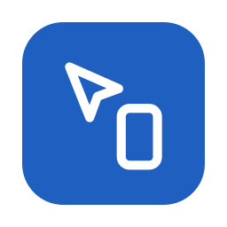
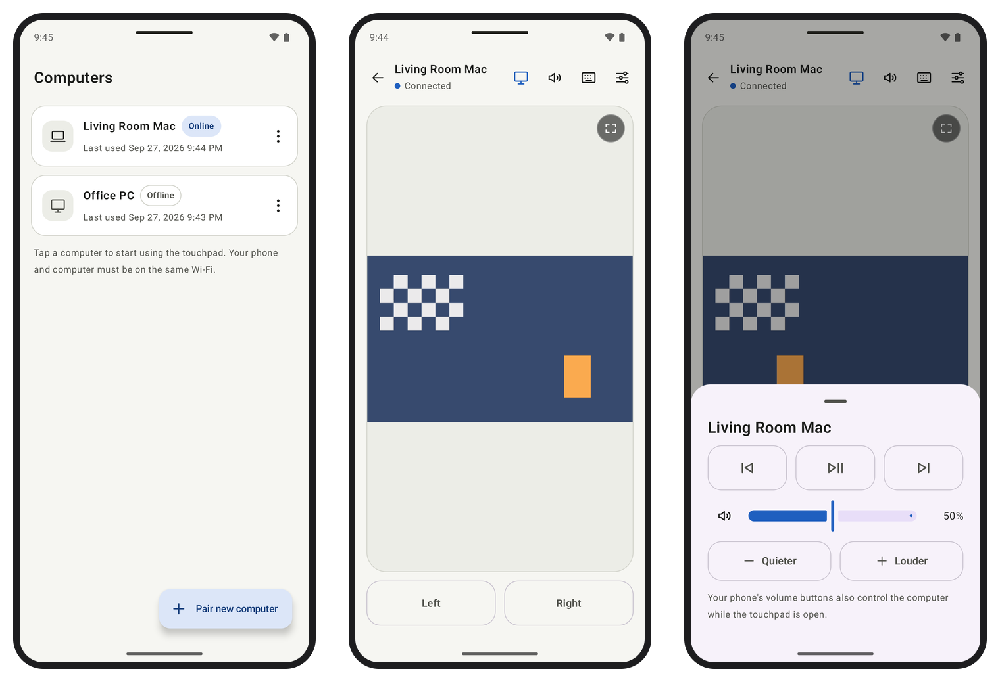
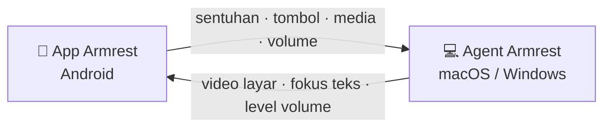

<div align="center">



# Armrest

**Komputermu, sejangkauan tangan.**

Jadikan HP sebagai touchpad, keyboard, dan remote untuk Mac atau PC Windows,
supaya tidak perlu bangun lagi hanya untuk mengklik "Skip Ad".

[](https://github.com/WailanTirajoh/armrest/actions/workflows/android.yml)
[](https://github.com/WailanTirajoh/armrest/actions/workflows/mac.yml)
[](https://github.com/WailanTirajoh/armrest/actions/workflows/windows.yml)
[](LICENSE)

[**Unduh**](https://github.com/WailanTirajoh/armrest/releases/latest) · [Cara kerja](#cara-kerja) · [Rencana](#rencana) · [English](README.md)



</div>

Kamu sudah nyaman di sofa, video sedang diputar di TV, lalu iklan muncul.
Tombol **Skip Ad** ada di sana, di seberang ruangan.

Armrest terdiri dari app di HP dan agent kecil di komputer. Pasangkan sekali lewat QR,
dan HP-mu menjadi touchpad, keyboard, remote media, dan pengatur volume. Semuanya lewat
WiFi rumah: tanpa akun, tanpa cloud.

## Fitur

- 🖱️ **Touchpad**: tap untuk klik, scroll dan klik kanan dengan 2 jari, tap lalu geser untuk drag. Rasanya seperti trackpad Mac.
- ⌨️ **Keyboard**: mengetik dengan keyboard HP (termasuk emoji dan koreksi otomatis), plus Esc, Tab, tombol panah, dan shortcut seperti ⌘C atau Ctrl+C.
- ✨ **Keyboard otomatis**: keyboard muncul saat kamu mengklik kolom teks di komputer, dan tertutup saat kamu keluar darinya.
- 📺 **Layar di HP**: lihat layar komputer di belakang touchpad. Cubit untuk zoom (tampilan mengikuti kursor), atau pakai layar penuh.
- ⏯️ **Kontrol media**: putar/jeda, berikutnya, dan sebelumnya untuk YouTube, Netflix, Spotify, dan apa pun yang merespons tombol media.
- 🔊 **Volume**: tombol volume HP mengatur volume komputer.
- 🔗 **Pairing sekali**: scan QR, izinkan di komputer, selesai. Tersambung ulang otomatis.
- 🔒 **Privat sejak awal**: hanya jaringan lokal, dienkripsi dengan sertifikat yang di-pin, dan setiap HP harus diizinkan di komputer.
- 💻 **macOS dan Windows**: macOS 13+, Windows 10/11 (x64 dan ARM64), satu HP untuk beberapa komputer. App berjalan di Android 8+; app iPhone sedang direncanakan.

## Kenapa Armrest?

App remote desktop dibuat untuk komputer yang jauh. Armrest untuk komputer yang *ada di situ*,
hanya saja tidak terjangkau.

- Skip iklan YouTube tanpa bangun
- Pause Netflix saat ada yang mulai bicara
- Ganti lagu sambil rebahan
- Kecilkan volume dari tempat tidur
- Kontrol laptop yang tersambung ke TV
- Ganti slide presentasi dari mana saja di ruangan

## Cara kerja



- **Penemuan**: agent mengumumkan diri di jaringan (Bonjour/mDNS), jadi app menemukannya lewat nama. Kalau jaringanmu memblokirnya, sambungkan lewat IP.
- **Pairing**: QR membawa token sekali pakai (berlaku 2 menit) dan fingerprint sertifikat agent. Setiap HP baru harus diizinkan di komputer.
- **Keamanan**: semua lalu lintas memakai TLS yang di-pin ke sertifikat dari QR. Setiap HP membuktikan identitasnya dengan menandatangani challenge baru memakai kuncinya sendiri (ECDSA P-256, disimpan di Android Keystore). Akses HP bisa dicabut kapan saja.
- **Layar**: video H.264, hanya dikirim selama app terbuka, dengan kontrol aliran supaya jaringan lambat melewatkan frame, bukan menumpuk.

Protokol lengkapnya ada di [protocol/PROTOCOL.md](protocol/PROTOCOL.md) (bahasa Inggris).

## Mulai

Semua file ada di halaman [Releases](https://github.com/WailanTirajoh/armrest/releases/latest).
Build dari setiap push ke `main` juga ada di tab [Actions](https://github.com/WailanTirajoh/armrest/actions):
buka salah satu run, lalu unduh dari bagian **Artifacts** (perlu login GitHub).

### 1. Pasang agent di komputer

- **macOS 13+**: unduh `.dmg`, seret **Armrest** ke Applications, lalu buka. App belum dinotarisasi Apple, jadi pertama kali klik kanan → **Open** (macOS 13–14), atau pakai **Open Anyway** di System Settings → Privacy & Security (macOS 15+). Izinkan **Accessibility** saat diminta; **Screen Recording** hanya perlu untuk melihat layar di HP. Armrest hanya muncul di menu bar, tanpa ikon di Dock.
- **Windows 10/11**: jalankan installer: `x64` untuk kebanyakan PC, `arm64` untuk Windows on ARM (termasuk VM di Mac Apple Silicon). Installer belum ditandatangani, jadi SmartScreen memperingatkan: pilih **More info → Run anyway**. Armrest berjalan di tray dan tidak butuh izin tambahan.

### 2. Pasang app di HP

Unduh `.apk`, lalu install (Android 8 atau lebih baru). HP mungkin meminta izin instal dari browser atau file manager dulu.

### 3. Pairing

1. Di komputer: klik ikon Armrest di menu bar atau tray → **Add device…** / **Tambah perangkat…**. QR muncul dan berlaku 2 menit.
2. Di HP: ketuk **Pair komputer baru**, lalu scan QR. Kamera bawaan HP juga bisa; Armrest akan terbuka sendiri.
3. Di komputer: klik **Allow** / **Izinkan**.

Selanjutnya cukup ketuk nama komputer di app. Kalau koneksi putus, app menyambung ulang sendiri.

Teks di app mengikuti bahasa perangkat: Indonesia kalau HP atau komputer berbahasa Indonesia, selain itu Inggris.

## Gesture

| Di HP | Di komputer |
| --- | --- |
| Geser 1 jari | Gerakkan kursor |
| Tap | Klik kiri |
| Tap 2 kali | Klik ganda |
| Tap 2 jari | Klik kanan |
| Geser 2 jari | Scroll (arah natural; di Mac mengikuti setelan scroll) |
| Tap, lalu tahan dan geser | Drag |
| Cubit (saat layar tampil) | Zoom layar komputer di HP |

## Memakai Armrest

- **Keyboard**: ketuk ikon keyboard di kanan atas touchpad. Apa yang kamu ketik muncul di app yang aktif di komputer, termasuk Backspace dan koreksi otomatis. Baris di atas kolom ketik berisi Esc, Tab, tombol panah, dan modifier: ⌘ ⌃ ⌥ ⇧ untuk Mac, atau Ctrl Win Alt Shift untuk Windows. Modifier berlaku untuk satu tombol berikutnya, jadi ketuk ⌘ lalu ketik `c` untuk ⌘C.
- **Keyboard otomatis**: keyboard terbuka saat kolom teks di komputer aktif (misalnya setelah kamu mengklik kolom pencarian), dan tertutup saat fokus pindah. Keyboard yang kamu buka sendiri tidak ditutup otomatis. Matikan lewat **Buka keyboard otomatis** di pengaturan touchpad.
- **Layar**: ketuk ikon monitor. Layar komputer, termasuk kursornya, tampil di belakang touchpad dan semua gesture tetap berfungsi di atasnya. Dengan beberapa monitor, yang tampil adalah monitor tempat kursor berada. Cubit untuk zoom sampai 4×; selama di-zoom, tampilan mengikuti kursor. Ketuk label zoom (mis. `2,0×`) untuk kembali ke tampilan penuh. Untuk layar penuh, ketuk ⛶ di kanan atas gambar; tombol Back keluar lagi. Di Mac, pertama kali dipakai akan diminta izin **Screen Recording**: nyalakan Armrest di System Settings, lalu pilih **Quit & Reopen**.
- **Volume & media**: selama touchpad terbuka, tombol volume HP mengatur komputer, bukan HP. Ikon speaker membuka **Volume & media**: slider, bisukan, serta sebelumnya / putar-jeda / berikutnya. Tombol media bekerja seperti tombol media di keyboard: mengontrol apa pun yang sedang diputar. Matikan tombol volume lewat **Tombol volume HP mengatur komputer** di pengaturan touchpad.
- **Pengaturan**: sensitivitas, kecepatan scroll, tombol kiri/kanan, dan getar saat klik ada di pengaturan touchpad. Untuk menghapus HP, pakai **Revoke…** / **Cabut…** di panel Armrest di komputer.

## Kalau ada masalah

- **App tidak menemukan komputer**: WiFi tamu, kantor, dan hotspot sering membuat perangkat tidak saling terlihat. Di app, buka menu ⋮ pada kartu komputer → **Sambungkan via IP…**. Alamatnya tertulis di panel Armrest di komputer (mis. `Siap · 192.168.1.20:47810`).
- **Keyboard tidak terbuka sendiri**: sebagian app tidak melaporkan kolom teksnya, misalnya game dan app remote desktop. VS Code, Slack, dan app Electron lain sengaja tidak dicek, karena VS Code lalu mengira ada screen reader. Buka keyboard lewat ikonnya.
- **Sebagian layar hitam**: video yang dilindungi DRM (Netflix, Apple TV+) dan jendela yang memblokir tangkapan layar. Kontrol media tetap berfungsi.
- **Tombol media mengontrol app yang salah**: tombol media masuk ke app yang dianggap komputer sedang memutar. Putar atau jeda sekali di app yang kamu mau.
- **Mac: kursor tidak bergerak atau ketikan tidak masuk**: pastikan panel Armrest di menu bar menampilkan "Izin Accessibility: Diizinkan".
- **Mac: layar tidak muncul di HP**: pastikan panel menampilkan "Izin Screen Recording: Diizinkan". Kalau toggle di System Settings sudah menyala tapi tetap ditolak (biasanya setelah update build tanpa signing), jalankan `tccutil reset ScreenCapture io.github.wailantirajoh.armrest.agent`, lalu izinkan ulang.
- **Mac: ketikan tidak masuk ke kolom password**: macOS memblokir ketikan dari app lain saat Secure Input aktif, misalnya di kolom password atau Terminal dengan Secure Keyboard Entry.
- **Mac: volume "Tidak bisa diatur"**: output HDMI dan DisplayPort biasanya tidak punya kontrol volume di Mac. Atur di monitornya; tombol media tetap berfungsi.
- **Windows: HP tidak bisa tersambung**: installer hanya membuka firewall untuk jaringan **Private** dan domain. Ubah WiFi menjadi Private di Settings → Network & internet → Wi-Fi → nama jaringan.
- **Windows: sebagian jendela tidak bisa dikontrol**: app yang berjalan sebagai administrator (mis. Task Manager), dialog UAC, dan layar kunci. Ini batasan Windows untuk app biasa.
- **Windows: tidak ada ikon di taskbar**: Armrest ada di tray; klik ^ di pojok kanan bawah kalau tersembunyi. Membuka Armrest lagi dari Start menu juga menampilkan panelnya.

## Dibuat dengan

| Bagian | Teknologi |
| --- | --- |
| App Android | Kotlin, Jetpack Compose, OkHttp, CameraX + ML Kit, MediaCodec |
| Agent macOS | Swift (SwiftPM), SwiftUI, Network.framework, ScreenCaptureKit, VideoToolbox, CoreAudio |
| Agent Windows | C# .NET 10, WPF, SendInput, UI Automation, Media Foundation, Core Audio |
| Protokol | WebSocket di atas TLS, pesan kontrol JSON, frame biner untuk input dan video, test vector bersama |

| Folder | Isi |
| --- | --- |
| [`android-app/`](android-app) | App Android |
| [`mac-agent/`](mac-agent) | Agent menu bar macOS |
| [`windows-agent/`](windows-agent) | Agent tray Windows dan installer |
| [`protocol/`](protocol) | [Spesifikasi protokol](protocol/PROTOCOL.md), [profil uji end-to-end](protocol/E2E.md), dan test vector bersama |
| [`scripts/`](scripts) | Packaging, setup signing CI, dan uji end-to-end |

## Build dari source

Kebutuhan: macOS 13+ dengan Command Line Tools (Xcode tidak wajib), JDK 17 dan Android SDK
dengan platform 37 (isi `sdk.dir` di `android-app/local.properties`, atau set `ANDROID_HOME`), dan .NET 10 SDK.
Agent Windows bisa dibangun dan dites dari macOS dan Linux, tapi hanya bisa dijalankan di Windows.

```bash
make test               # unit test Swift, Kotlin, dan C#
make mac                # dist/Armrest.app dan DMG, tanda tangan ad-hoc
make android            # APK debug
make windows            # agent Windows (installer dibuat CI)
./scripts/e2e-local.sh  # agent sungguhan vs kode klien Android, end-to-end
```

Uji end-to-end menjalankan setiap agent dengan profil uji terpisah yang tidak pernah menyentuh
input, layar, volume, atau data aslimu. Kode klien Android, yang dijalankan di JVM, melakukan pairing,
autentikasi, mengirim input dan tombol media, lalu mengecek fokus, volume, video layar, sambung ulang,
dan penolakan. Di Windows, `./scripts/e2e-windows.ps1` juga menguji encoder video; CI menjalankannya
di setiap push. Lihat [protocol/E2E.md](protocol/E2E.md).

Untuk menguji dengan emulator Android, jalankan agent dengan `ARMREST_PROFILE=e2e ARMREST_E2E_ADDRESS=10.0.2.2 ARMREST_E2E_AUTO_APPROVE=1 ARMREST_E2E_PAIRING_FILE=<file>`,
lalu buka URI dari file itu di emulator: `adb shell am start -a android.intent.action.VIEW -d '<uri>'`.

### Rilis dan signing

Setiap push ke `main` membangun APK, DMG, dan installer Windows (x64 dan arm64) sebagai artifact
workflow. Push tag `v*` menerbitkan semuanya ke [Releases](https://github.com/WailanTirajoh/armrest/releases).

CI tetap jalan tanpa secret: APK ditandatangani debug key dan app Mac ditandatangani ad-hoc.
Akibatnya APK baru tidak bisa menimpa yang sudah terpasang, dan macOS meminta izin Accessibility
serta Screen Recording lagi setiap update. Untuk signing yang tetap, jalankan sekali:

```bash
./scripts/setup-signing.sh
```

Skrip ini membuat keystore Android dan sertifikat code signing self-signed, menyimpannya sebagai
enam GitHub secret, dan menyimpan backup di `~/armrest-signing/` untuk password manager-mu. Installer
Windows belum ditandatangani, jadi SmartScreen selalu memperingatkan; identitas agent dan HP
terpercaya tetap tersimpan antar-update.

## Rencana

- [ ] App iPhone
- [ ] Tombol shortcut yang bisa diatur sendiri
- [ ] Peluncur app
- [ ] Sinkronisasi clipboard
- [ ] Kirim file
- [ ] Sleep, kunci, dan matikan komputer
- [ ] Agent Linux
- [ ] Streaming layar yang lebih mulus di Windows (encoder hardware)

## Kontribusi

Ide, laporan bug, dan pull request sangat diterima. Kalau ada yang bisa membuat mengontrol komputer
dari sofa jadi lebih mudah, [buka issue](https://github.com/WailanTirajoh/armrest/issues).

## Lisensi

[MIT](LICENSE) © 2026 Wailan Tirajoh

---

<sub>**Kenapa "Armrest"?** Karena remote terbaik adalah yang tergeletak di sandaran tangan sofa. 🛋️</sub>
