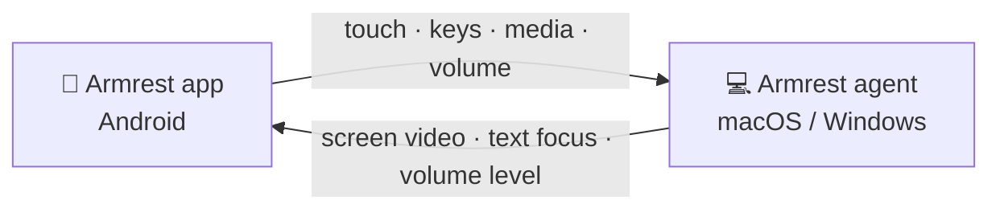

<div align="center">


# Armrest

**Your computer, within arm's reach.**

Turn your phone into a touchpad, keyboard, and remote for your Mac or Windows PC,
and never get up to click "Skip Ad" again.

[](https://github.com/WailanTirajoh/armrest/actions/workflows/android.yml)
[](https://github.com/WailanTirajoh/armrest/actions/workflows/mac.yml)
[](https://github.com/WailanTirajoh/armrest/actions/workflows/windows.yml)
[](LICENSE)

[**Download**](https://github.com/WailanTirajoh/armrest/releases/latest) · [How it works](#how-it-works) · [Roadmap](#roadmap) · [Bahasa Indonesia](README.id.md)


</div>

You're settled on the couch, a video is playing on the TV, and an ad pops up.
The **Skip Ad** button is right there, all the way across the room.

Armrest is an app for your phone and a small agent for your computer. Pair them once with a
QR code, and your phone becomes a touchpad, keyboard, media remote, and volume knob. It runs on
your home Wi-Fi: no account, no cloud.

## Features

- 🖱️ **Touchpad**: tap to click, two-finger scroll and right-click, tap-and-drag. Feels like a Mac trackpad.
- ⌨️ **Keyboard**: type with your phone's keyboard (emoji and autocorrect included), plus Esc, Tab, arrows, and shortcuts like ⌘C or Ctrl+C.
- ✨ **Auto keyboard**: the keyboard pops up when you click into a text field on your computer, and hides when you leave it.
- 📺 **Screen on your phone**: see your computer's screen behind the touchpad. Pinch to zoom (the view follows your cursor), or go full screen.
- ⏯️ **Media controls**: play/pause, next, and previous for YouTube, Netflix, Spotify, and anything else that responds to media keys.
- 🔊 **Volume**: your phone's volume buttons control your computer's volume.
- ⏻ **Power**: put the computer to sleep, restart it, or shut it down, and wake it again with Wake-on-LAN (same network, Wake-on-LAN enabled on the computer).
- 🔗 **Pair once**: scan a QR code, approve on the computer, done. Reconnects automatically.
- 🔒 **Private by design**: local network only, encrypted with a pinned certificate, and every phone must be approved on the computer.
- 💻 **macOS and Windows**: macOS 13+, Windows 10/11 (x64 and ARM64), one phone for several computers. The app runs on Android 8+; an iPhone app is planned.

## Why Armrest?

Remote desktop apps are built for computers that are far away. Armrest is for the computer
that's *right there*, just not within reach.

- Skip a YouTube ad without getting up
- Pause Netflix when someone starts talking
- Skip a song while you're lying down
- Turn the volume down from bed
- Drive a laptop that's plugged into your TV
- Click through slides from anywhere in the room

## How it works



- **Discovery**: the agent announces itself on your network (Bonjour/mDNS), so the app finds it by name. If your network blocks that, connect by IP.
- **Pairing**: the QR code carries a one-time token (valid for 2 minutes) and the agent's certificate fingerprint. Every new phone must be approved on the computer.
- **Security**: all traffic is TLS, pinned to the certificate from the QR code. Each phone proves itself by signing a fresh challenge with its own key (ECDSA P-256, kept in the Android Keystore). You can revoke a phone at any time.
- **Screen**: H.264 video, sent only while the app is open, with flow control so a slow network skips frames instead of lagging.

The full protocol is documented in [protocol/PROTOCOL.md](protocol/PROTOCOL.md).

## Getting started

Everything you need is on the [Releases](https://github.com/WailanTirajoh/armrest/releases/latest) page.
Builds of every push to `main` are also on the [Actions](https://github.com/WailanTirajoh/armrest/actions)
tab: open a run and download from **Artifacts** (requires a GitHub sign-in).

### 1. Install the agent on your computer

- **macOS 13+**: download the `.dmg`, drag **Armrest** to Applications, and open it. The app isn't notarized yet, so the first time, right-click it → **Open** (macOS 13–14) or use **Open Anyway** under System Settings → Privacy & Security (macOS 15+). Grant **Accessibility** when asked; **Screen Recording** is only needed to see your screen on the phone. Armrest lives in the menu bar, with no Dock icon.
- **Windows 10/11**: run the installer: `x64` for most PCs, `arm64` for Windows on ARM (including VMs on Apple silicon Macs). SmartScreen warns because the installer isn't signed yet: choose **More info → Run anyway**. Armrest lives in the system tray and needs no extra permissions.

### 2. Install the app on your phone

Download the `.apk` and install it (Android 8 or newer). Your phone may ask you to allow installs from your browser or file manager first.

### 3. Pair

1. On the computer: click the Armrest icon in the menu bar or tray → **Add device…**. A QR code appears, valid for 2 minutes.
2. On the phone: tap **Pair new computer** and scan the QR code. Your phone's camera app works too; it opens Armrest for you.
3. On the computer: click **Allow**.

Next time, just tap your computer in the app. If the connection drops, the app reconnects by itself.

## Gestures

| On your phone | On your computer |
| --- | --- |
| Slide one finger | Move the cursor |
| Tap | Left click |
| Double tap | Double click |
| Two-finger tap | Right click |
| Two-finger slide | Scroll (natural direction; on a Mac it follows your scrolling setting) |
| Tap, then hold and slide | Drag |
| Pinch (while the screen is shown) | Zoom the screen on your phone |

## Using Armrest

- **Keyboard**: tap the keyboard icon at the top right of the touchpad. What you type shows up in the active app on your computer, including Backspace and autocorrect. The row above the text field has Esc, Tab, the arrow keys, and modifiers: ⌘ ⌃ ⌥ ⇧ for a Mac, or Ctrl Win Alt Shift for Windows. A modifier applies to the next key, so tap ⌘ and type `c` for ⌘C.
- **Auto keyboard**: the keyboard opens when a text field on your computer gets focus (say, after you click a search box) and closes when focus leaves. A keyboard you opened yourself stays open. Turn this off with **Open keyboard automatically** in the touchpad settings.
- **Screen**: tap the monitor icon. Your computer's screen, cursor included, appears behind the touchpad and every gesture still works on top of it. With several monitors, you see the one the cursor is on. Pinch to zoom up to 4×; while zoomed, the view follows the cursor. Tap the zoom label (like `2.0×`) to zoom back out. For full screen, tap ⛶ at the top right of the picture; Back exits. On a Mac, the first time asks for **Screen Recording**: turn Armrest on in System Settings, then choose **Quit & Reopen**.
- **Volume & media**: while the touchpad is open, your phone's volume buttons control the computer instead of the phone. The speaker icon opens **Volume & media**: a slider, mute, and previous / play-pause / next. The media buttons work like the media keys on a keyboard: they control whatever is playing. Turn the volume buttons off with **Volume buttons control the computer** in the touchpad settings.
- **Settings**: sensitivity, scroll speed, left/right buttons, and vibrate on click are in the touchpad settings. To remove a phone, use **Revoke…** in the Armrest panel on the computer.

## Troubleshooting

- **The app can't find my computer**: guest, office, and hotspot Wi-Fi often stop devices from seeing each other. In the app, open the ⋮ menu on the computer's card → **Connect by IP…**. The address is shown in the Armrest panel on the computer (for example `Ready · 192.168.1.20:47810`).
- **The keyboard doesn't open by itself**: some apps don't report their text fields, like games and remote desktop clients. VS Code, Slack, and other Electron apps are skipped on purpose, because checking them makes VS Code think a screen reader is running. Open the keyboard with its icon instead.
- **Parts of the screen are black**: DRM-protected video (Netflix, Apple TV+) and windows that block screen capture. Media controls still work.
- **Media keys control the wrong app**: they go to the app your computer considers "now playing". Play or pause once in the app you want.
- **Mac: the cursor doesn't move, or typing doesn't arrive**: check that the Armrest panel in the menu bar says "Accessibility permission: Allowed".
- **Mac: the screen doesn't show on the phone**: check that the panel says "Screen Recording permission: Allowed". If the switch in System Settings is on but access is still denied (usually after updating an unsigned build), run `tccutil reset ScreenCapture io.github.wailantirajoh.armrest.agent` and allow it again.
- **Mac: typing doesn't reach a password field**: macOS blocks typing from other apps while Secure Input is on, for example in password fields or in Terminal with Secure Keyboard Entry.
- **Mac: the volume says "Can't be adjusted"**: HDMI and DisplayPort outputs usually have no volume control on a Mac. Use the monitor's buttons; media keys still work.
- **Windows: the phone can't connect**: the installer only opens the firewall for **Private** and domain networks. Set your Wi-Fi to Private under Settings → Network & internet → Wi-Fi → your network.
- **Windows: some windows ignore input**: apps running as administrator (like Task Manager), UAC prompts, and the lock screen are off-limits to regular apps.
- **Windows: there's no taskbar icon**: Armrest lives in the tray; click ^ at the bottom right if it's hidden. Opening Armrest again from the Start menu also shows its panel.

## Built with

| Part | Stack |
| --- | --- |
| Android app | Kotlin, Jetpack Compose, OkHttp, CameraX + ML Kit, MediaCodec |
| macOS agent | Swift (SwiftPM), SwiftUI, Network.framework, ScreenCaptureKit, VideoToolbox, CoreAudio |
| Windows agent | C# .NET 10, WPF, SendInput, UI Automation, Media Foundation, Core Audio |
| Protocol | WebSocket over TLS, JSON control messages, binary input and video frames, shared test vectors |

| Folder | Contents |
| --- | --- |
| [`android-app/`](android-app) | Android app |
| [`mac-agent/`](mac-agent) | macOS menu bar agent |
| [`windows-agent/`](windows-agent) | Windows tray agent and installer |
| [`protocol/`](protocol) | [Protocol spec](protocol/PROTOCOL.md), [end-to-end test profile](protocol/E2E.md), and shared test vectors |
| [`scripts/`](scripts) | Packaging, CI signing setup, and end-to-end tests |

## Building from source

You need macOS 13+ with the Command Line Tools (Xcode is optional), JDK 17 and the Android SDK
with platform 37 (set `sdk.dir` in `android-app/local.properties`, or `ANDROID_HOME`), and the .NET 10 SDK.
The Windows agent builds and tests on macOS and Linux, but only runs on Windows.

```bash
make test               # Swift, Kotlin, and C# unit tests
make mac                # dist/Armrest.app and a DMG, ad-hoc signed
make android            # debug APK
make windows            # Windows agent (the installer is built in CI)
./scripts/e2e-local.sh  # real agents vs the Android client code, end to end
```

The end-to-end test runs each agent with a separate test profile that never touches your real
input, screen, volume, or data. The Android client code, running on the JVM, pairs, authenticates,
sends input and media keys, and checks focus, volume, screen video, reconnection, and rejections.
On Windows, `./scripts/e2e-windows.ps1` also covers the video encoder; CI runs it on every push.
See [protocol/E2E.md](protocol/E2E.md).

To test with the Android emulator, run an agent with `ARMREST_PROFILE=e2e ARMREST_E2E_ADDRESS=10.0.2.2 ARMREST_E2E_AUTO_APPROVE=1 ARMREST_E2E_PAIRING_FILE=<file>`,
then open the URI from that file in the emulator: `adb shell am start -a android.intent.action.VIEW -d '<uri>'`.

### Releases and signing

Every push to `main` builds the APK, the DMG, and the Windows installers (x64 and arm64) as
workflow artifacts. Releases are automated with [release-please](https://github.com/googleapis/release-please)
from [Conventional Commits](https://www.conventionalcommits.org/):

- Name commits, or PR titles when squash merging, like `feat: scroll button`, `fix: reconnect after sleep`,
  or `feat!: new pairing protocol`. A check on every PR enforces this for the title.
- On each push to `main`, a release PR collects them, bumps `VERSION`, and updates `CHANGELOG.md`.
  `feat` raises the minor version, `fix` and `perf` the patch; `chore`, `ci`, `docs`, `refactor`,
  and `test` don't trigger a release.
- Merging the release PR tags `vX.Y.Z`, builds everything, and publishes it to
  [Releases](https://github.com/WailanTirajoh/armrest/releases) with the changelog as notes.
  The release stays a draft until all files are attached.
- To rebuild a release's files, run the Release workflow manually from its tag.

CI works without any secrets: the APK is signed with a debug key and the Mac app ad hoc. The catch
is that a new APK can't replace an installed one, and macOS asks for Accessibility and Screen
Recording again after every update. For stable signing, run once:

```bash
./scripts/setup-signing.sh
```

It creates an Android keystore and a self-signed code signing certificate, stores them as six
GitHub secrets, and keeps a backup in `~/armrest-signing/` for your password manager. The Windows
installer isn't signed yet, so SmartScreen always warns; the agent's identity and trusted phones
survive updates.

## Roadmap

- [ ] iPhone app
- [ ] Customizable shortcut buttons
- [ ] App launcher
- [ ] Clipboard sync
- [ ] File transfer
- [x] Sleep, restart, shutdown, and Wake-on-LAN
- [ ] Lock
- [ ] Linux agent
- [ ] Smoother screen streaming on Windows (hardware encoder)

## Contributing

Ideas, bug reports, and pull requests are welcome. If something would make controlling a computer
from the couch easier, [open an issue](https://github.com/WailanTirajoh/armrest/issues).

## License

[MIT](LICENSE) © 2026 Wailan Tirajoh

---

<sub>**Why "Armrest"?** Because the best remote is the one resting on the arm of your couch. 🛋️</sub>
